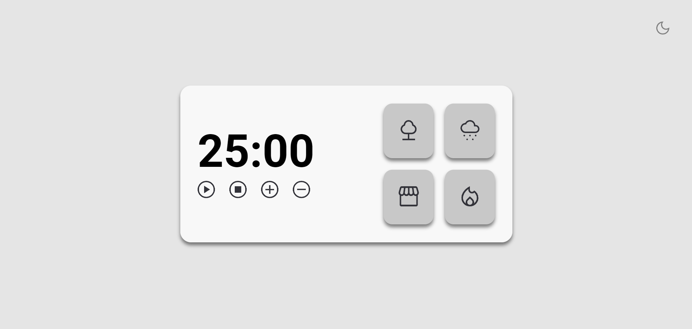
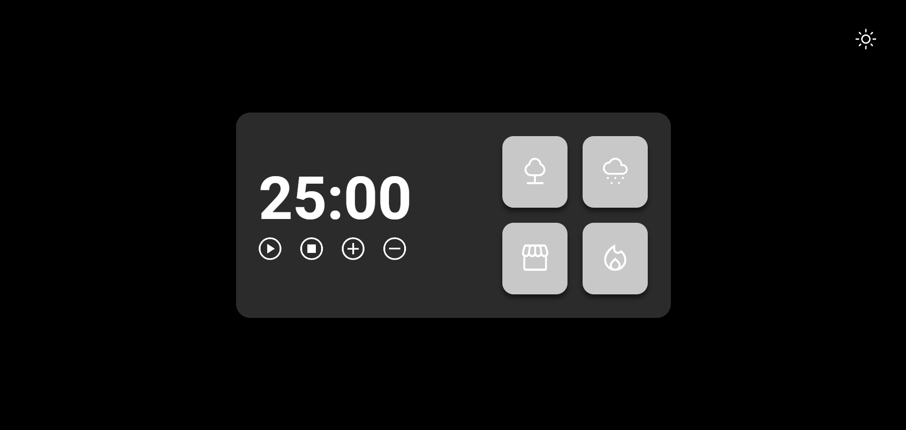

<h1 align="center"> Project - Focus Timer 3.0 Pomodoro style🌙🕗🌑</h1>

Time to put into practice what was taught in the first phase of stage 05 and what was seen in the previous stages.

  <a href="#-Technologies">Technologies</a>&nbsp;&nbsp;&nbsp;|&nbsp;&nbsp;&nbsp;
  <a href="#-Project">Project</a>&nbsp;&nbsp;&nbsp;|&nbsp;&nbsp;&nbsp;
  <a href="#-Layout">Layout</a>&nbsp;&nbsp;&nbsp;|&nbsp;&nbsp;&nbsp;
  <a href="#memo-license">license</a>

  

 

## 🚀 Technologies used in the project

It was produced with the following

&nbsp;
&nbsp;
&nbsp;

## 💻 Project

Focus Timer with the possibility of adjusting the time. The timer will have the option to select the desired sound, as well as its volume. Functions like volume control and dark-mode are included in it. As the project gives us the freedom to add something else to the project, I decided to make the project inspired by the album "Bonda 3" by the artist MC VV, you will be able to find these references during the project cards.

## 🔖 Project Layout

 
 

 
 Figma link: 
 
https://www.figma.com/file/XZEf8MX7lyyvqwa5fRdn5a/Stage-05---Dark-Mode-FocusTimer-(Copy)?node-id=0%3A1&mode=dev

 

## Apprenticeship

- Arrays;
- Functions in Javascript;
- DOM manipulation;
- HTML data structure;
- Animations with CSS;
- Git e Github;
- Functions *callback*;
- setTimeOut for countdown
- Sounds in JS
- Object Literals

 
 

## Website
https://mvrilonascimento.github.io/FocusTimer-PomodoroStyle/
---